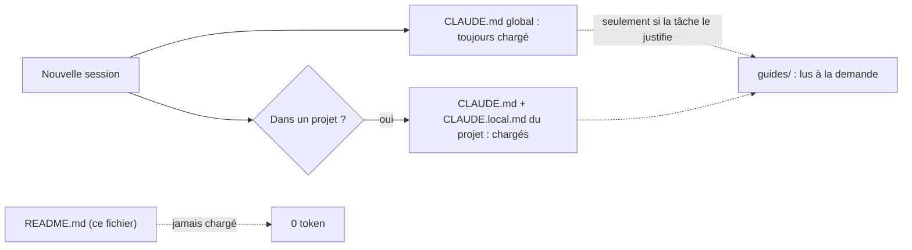
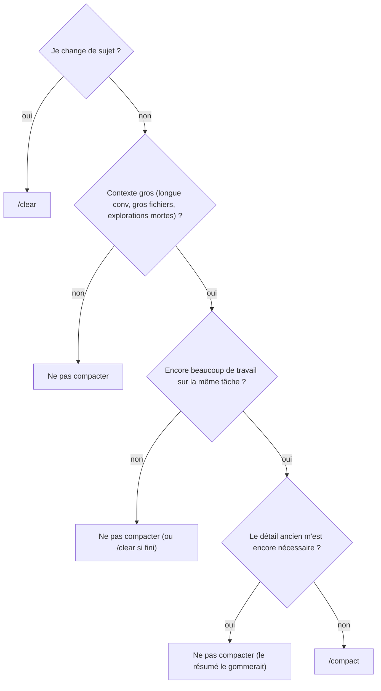

# 🧭 Utiliser Claude Code — mémo perso

> ℹ️ Ce fichier est **pour moi** (l'utilisateur), pas pour le modèle. Il vit dans&nbsp;`~/.claude`&nbsp;à côté du&nbsp;`CLAUDE.md`&nbsp;global, mais ==n'est pas chargé automatiquement== dans le contexte de Claude : le lire ne coûte donc **aucun token** au modèle. On y accumule au fil des discussions les techniques d'usage de Claude — surtout celles qui réduisent la consommation de tokens.

## 📁 Le dossier&nbsp;`~/.claude`

`~/.claude`
:   Configuration globale de Claude Code, valable pour **toutes** les sessions et tous les projets.

`CLAUDE.md`&nbsp;(ici, global)
:   Instructions **chargées automatiquement** dans le contexte de **chaque** conversation. Comme il est rechargé en permanence, tout ce qu'on y met coûte des tokens à chaque tour → le garder **léger**.

`CLAUDE.md`&nbsp;de projet /&nbsp;`CLAUDE.local.md`
:   Le premier est versionné et partagé, le second perso, propre à la machine, non versionné. Eux aussi sont chargés auto, mais seulement quand je travaille dans ce projet.

`guides/`
:   Procédures détaillées, **lues à la demande** seulement (jamais chargées auto). On y sort le détail pour alléger le&nbsp;`CLAUDE.md`.



## ⚖️&nbsp;`CLAUDE.md`&nbsp;vs&nbsp;`README.md`&nbsp;— quoi va où

| Fichier | Destinataire | Chargé auto ? | Contenu |
|---|---|---|---|
| `CLAUDE.md` | le **modèle** 🤖 | oui (coûte des tokens) | comment Claude doit se comporter |
| `README.md`&nbsp;(ce fichier) | **moi** 🙋 | non (gratuit) | techniques d'usage, rappels d'habitudes, mémos |

> 💡 Règle au jour le jour : une info qui **dit au modèle comment agir** →&nbsp;`CLAUDE.md`. Une info qui me **rappelle une bonne pratique** ou que **moi seul peux exécuter** (ex. taper&nbsp;`/clear`) → ici,&nbsp;`README.md`.

## 💸 Réduire la consommation de tokens

Techniques accumulées au fil des sessions. La mention 🤖 indique ce qui est **déjà câblé côté modèle** (Claude agit tout seul) ; 🙋 ce qui reste à **ma** charge.

- [x] 🙋 **`/clear`&nbsp;en fin de tâche**, avant de fermer VS Code / la session (sauf si je compte reprendre cette conversation précise juste après). Rouvrir une vieille session recharge **tout** son historique et consomme des tokens pour rien si je n'en ai plus besoin.
    - 🤖 Rien côté&nbsp;`CLAUDE.md`&nbsp;: habitude 100 % perso, le modèle ne peut pas&nbsp;`/clear`&nbsp;à ma place.
- [x] 🙋 **Clore la conversation par « ok merci », « c'est bon », « on en a fini »…** avant le&nbsp;`/clear`.
    - 🤖 Claude détecte la fin, relit la conversation, enregistre en mémoire persistante ce qui mérite d'être retenu (ou propose de le mettre dans&nbsp;`CLAUDE.md`&nbsp;/ une doc), puis liste ce qu'il a retenu.
- [x] 🙋 **`/compact`&nbsp;avec discernement** (voir le zoom ci-dessous pour le point de bascule).
    - 🤖 Claude me **prévient** si un&nbsp;`/compact`&nbsp;serait contre-productif avant de l'exécuter.
- [x] 🙋 **Choisir le bon modèle / effort** pour la tâche.
    - 🤖 Claude me **signale** dès la demande un décalage — tâche trop lourde pour la config (monter) ou triviale (descendre, moins cher).
- [x] **Garder le&nbsp;`CLAUDE.md`&nbsp;léger** : n'y laisser que le tronc commun toujours utile, sortir les procédures spécifiques vers&nbsp;`guides/`.
    - 🤖 Renvoi à&nbsp;`guides/rediger-claude-md.md`&nbsp;(règles de compression), appliquées dès qu'on touche un&nbsp;`CLAUDE.md`.
- [x] **Cibler les lectures** : demander une plage de lignes plutôt qu'un fichier entier, préférer Grep/Glob aux explorations larges. Pour une exploration vraiment large, un subagent Explore isole le coût hors du contexte principal.
    - 🤖 Déjà consigne du modèle (lectures partielles, recherches ciblées, subagent Explore quand ça vaut le coup).

### 🗜️ Zoom :&nbsp;`/compact`&nbsp;— le point de bascule utile / inutile

Ce que fait&nbsp;`/compact`&nbsp;: Claude **lit tout le contexte actuel** et le **réécrit en un résumé court**, qui remplace l'historique détaillé ; la conversation continue sur ce résumé.

Il y a donc **deux mouvements de tokens opposés** :

Coût immédiat, unique
:   Produire le résumé = lire tout le contexte (entrée) + écrire le résumé (sortie). Payé une fois, maintenant.

Gain différé, récurrent
:   Chaque tour **suivant** transporte le petit résumé au lieu du gros historique. Économie par tour ≈ *(taille du contexte − taille du résumé)*, qui **s'accumule** sur tous les tours restants.

Le basculement se joue sur :

$$
\underbrace{(\text{contexte} - \text{résumé})}_{\text{gain par tour}} \times \text{tours restants} \quad \text{vs} \quad \text{coût du résumé}
$$



- ❌ **Inutile / contre-productif quand :**
    - le contexte est **encore petit** → presque rien à gagner, mais on paie quand même la résumation et on **perd du détail** ;
    - je suis **en fin de tâche** / sur le point de&nbsp;`/clear`&nbsp;→ aucun tour futur pour amortir le gain : mieux vaut&nbsp;`/clear`&nbsp;directement ;
    - le **détail restant m'est encore nécessaire** → le résumé risque de le gommer.
- ✅ **Utile quand les deux conditions sont réunies :**
    - le contexte est devenu **gros** (longue conversation, gros fichiers lus, explorations mortes qui traînent) **ET**
    - il reste **beaucoup de travail** sur la même tâche pour rentabiliser le résumé.

> 💡 Règle de pouce :&nbsp;`/compact`&nbsp;sert à ==récupérer de la place en cours de route== quand l'historique est lourd de choses **devenues inutiles** et qu'on va **continuer longtemps**. Si le contexte est léger, ou si j'ai bientôt fini → **ne pas compacter**. Si je change carrément de sujet →&nbsp;`/clear`&nbsp;(repart de zéro, garde le&nbsp;`CLAUDE.md`) plutôt que&nbsp;`/compact`&nbsp;(garde un résumé pour poursuivre la **même** tâche)[^autocompact].

### 🔎 Zoom : l'agent Explore épinglé sur Sonnet

Fichier&nbsp;`~/.claude/agents/Explore.md`&nbsp;(config du subagent Explore). Par défaut, un subagent **hérite du modèle de la session parente** — donc si je tourne sur Opus, une exploration lancerait Opus aussi, cher pour une tâche mécanique. On a **surchargé** sa config pour le forcer sur&nbsp;`model: sonnet`,&nbsp;`effort: low`, quel que soit le modèle principal.

Pourquoi : l'exploration (chercher des fichiers, lire des extraits, repérer des conventions) est une tâche **large mais peu exigeante en raisonnement** ; Sonnet effort low la fait très bien, beaucoup moins cher. Et le subagent **isole** ces lectures hors du contexte principal — il ne remonte qu'une **synthèse**, pas les fichiers bruts. ==Double économie== : modèle moins cher **et** contexte principal préservé.

Pourquoi Sonnet et pas Haiku ?
:   Le parent agit **à l'aveugle sur la synthèse** d'Explore (il ne voit jamais les fichiers bruts) : une erreur d'exploration — fichier pertinent manqué, convention mal lue, bruit pris pour du signal — se propage **silencieusement** dans la suite, potentiellement sur Opus. Coût asymétrique. Or, par consigne, on n'invoque Explore que pour des recherches **larges / à portée floue** — justement les cas où le **jugement** (décider ce qui est pertinent, synthétiser) compte le plus, et où Haiku peut décrocher. Le gain Haiku vs Sonnet-low est modeste en absolu ; le jeu n'en vaut pas la chandelle[^haiku].

Pourquoi effort&nbsp;`low`&nbsp;et pas plus ?
:   L'effort agit sur la **profondeur de raisonnement par étape** ; Explore est une tâche de **largeur** (ratisser, résumer), pas de raisonnement profond — celui-ci reste le rôle du parent. Monter l'effort coûterait plus de tokens et de **latence** (le parent attend) pour un gain quasi nul. Si une synthèse paraît superficielle sur une exploration vraiment tordue, monter à&nbsp;`medium`&nbsp;**ponctuellement**, pas en défaut. Le vrai levier de qualité est ailleurs : la **précision de la consigne** donnée à l'agent.

## 📚 Les&nbsp;`guides/`&nbsp;: des sous-`CLAUDE.md`

Chaque&nbsp;`CLAUDE.md`&nbsp;peut s'accompagner d'un dossier&nbsp;`guides/`&nbsp;voisin. L'idée : un&nbsp;`CLAUDE.md`&nbsp;est chargé **en entier à chaque conversation** — y entasser toutes les procédures détaillées le rendrait lourd en permanence. Alors on **déporte** chaque procédure spécifique dans un&nbsp;`guides/xxx.md`, et on ne laisse dans le&nbsp;`CLAUDE.md`&nbsp;qu'un **renvoi d'une ligne** (chemin + rôle).

Ces guides sont donc des **sous-`CLAUDE.md`** : mêmes règles de rédaction et de compression (voir&nbsp;`guides/rediger-claude-md.md`), à **une** différence près — ils ne sont ==jamais chargés automatiquement==. Claude ne les ouvre que si la tâche du moment le justifie. Le détail reste ainsi disponible sans peser sur le contexte tant qu'on ne s'en sert pas. C'est ce qui explique, dans les tableaux ci-dessous, que les&nbsp;`guides/`&nbsp;(~27 000 tok au total) ne coûtent presque jamais rien en pratique.

## ⚖️ Poids en tokens des&nbsp;`CLAUDE.md`&nbsp;et guides du système

Estimation (règle de pouce ~3,7 caractères/token, approximatif). **Dernière mise à jour : 2026-07-05.**

- [ ] 🔄 À rafraîchir **à la main** : demander à Claude de *relancer une exploration + comptage des&nbsp;`CLAUDE.md`/`CLAUDE.local.md`&nbsp;et de leurs&nbsp;`guides/`*, puis mettre à jour les tableaux et la date ci-dessus.

Chaque CLAUDE.md est regroupé avec son dossier&nbsp;`guides/`&nbsp;sous un titre qui donne le chemin commun ; les tables ne listent que le nom relatif. Le dossier&nbsp;`guides/`&nbsp;apparaît en **une seule ligne** avec son poids total (détail non affiché). Les CLAUDE.md sans guide sont rassemblés à part. Les&nbsp;`guides/`&nbsp;sont toujours « à la demande » (jamais auto).

**🌍&nbsp;`~/.claude/`&nbsp;— global, chargé à _chaque_ session**

| Fichier | Tok |
|---|---:|
| `CLAUDE.md` | 894 |
| `README.md` | 0 (non chargé — ce fichier) |
| `guides/`&nbsp;(1 fichier) | 846 |

**📦 CLAUDE.md sans guide — chargés avec le projet concerné**

| Fichier | Tok |
|---|---:|
| `TiddlyWiki5/CLAUDE.md` | 1 701 |
| `plugins/kookma/CLAUDE.md` | 409 |
| `plugins/kookma/TW-Commander/CLAUDE.md` | 2 057 |
| `plugins/nikorion/TW-Chart/CLAUDE.md` | 1 781 |
| `plugins/nikorion/TW-Fonts/CLAUDE.md` | 985 |
| `plugins/nikorion/TW-Math/CLAUDE.md` | 2 645 |
| `plugins/nikorion/TW-Plugin-Info-Tree/CLAUDE.md` | 1 361 |
| `plugins/nikorion/TW-Scroll-Layout/CLAUDE.md` | 1 409 |
| `plugins/nikorion/TW-Shields/CLAUDE.md` | 1 289 |

**📦&nbsp;`…\plugins\nikorion\`&nbsp;— CLAUDE.md + guides**

| Fichier | Tok |
|---|---:|
| `CLAUDE.md` | 1 691 |
| `CLAUDE.local.md` | 209 |
| `guides/`&nbsp;(4 fichiers) | 7 924 |

**📦&nbsp;`…\plugins\nikorion\TiddlyDev\`&nbsp;— CLAUDE.md + guides**

| Fichier | Tok |
|---|---:|
| `CLAUDE.md` | 3 431 |
| `guides/`&nbsp;(5 fichiers) | 11 041 |

**📦&nbsp;`…\plugins\nikorion\TW-Hover-Tilt\`&nbsp;— CLAUDE.md + guides**

| Fichier | Tok |
|---|---:|
| `CLAUDE.md` | 2 303 |
| `guides/`&nbsp;(6 fichiers) | 7 253 |

**Totaux estimés**

| Ensemble | Tok |
|---|---:|
| `CLAUDE.md`&nbsp;+&nbsp;`CLAUDE.local.md`&nbsp;(chargeables auto selon le projet) | ~22 165 |
| `guides/`&nbsp;(jamais auto, uniquement à la demande) | ~27 064 |
| **Total** | **~49 229** |

> 💡 À retenir : seul le **global** (`~/.claude/CLAUDE.md`, ~894 tok) pèse à **chaque** session. Les autres ne se chargent que dans leur projet, et les&nbsp;`guides/`&nbsp;seulement quand on les ouvre.

### 🩺 Ces poids, lourds ou pas ? Faut-il les compacter ?

Non, rien d'alarmant ✅ :

- La fenêtre de contexte des modèles Claude est de l'ordre de **200 000 tokens**. Même le plus gros&nbsp;`CLAUDE.md`&nbsp;(TiddlyDev, ~3 431 tok) pèse **< 2 %**. Le chargement réel dans un projet — global (~894) +&nbsp;`CLAUDE.md`&nbsp;du projet +&nbsp;`.local`&nbsp;— reste **quelques milliers de tokens** (ex. nikorion : ~2 800). Négligeable.
- Le seul payé en **permanence** est le global, déjà **léger**. Les per-projet ne se chargent que dans leur projet ; les&nbsp;`guides/`&nbsp;jamais (à la demande) → leurs ~27 000 tok ne comptent quasi pas.

Donc **pas de compactage urgent**. À garder à l'œil 👀 seulement les plus gros&nbsp;`CLAUDE.md`&nbsp;— TiddlyDev (~3 431), TW-Math (~2 645), TW-Hover-Tilt (~2 303), TW-Commander (~2 057) : s'ils continuent de grossir ou se répètent, passer un coup de compression (règles de&nbsp;`guides/rediger-claude-md.md`) ou déporter du détail vers&nbsp;`guides/`. Les&nbsp;`guides/`&nbsp;eux-mêmes ne rentrent pas dans ce calcul.

## 📖 Lire les&nbsp;`.md`&nbsp;: Markdown Viewer dans Firefox Developer Edition

Les docs&nbsp;`.md`&nbsp;que Claude génère sont écrits pour l'extension **Markdown Viewer** (MIT,&nbsp;`simov/markdown-viewer`). Installation, à refaire sur une nouvelle machine :

- [ ] **1. Associer&nbsp;`.md`&nbsp;à Developer Edition** : clic droit › Ouvrir avec › Choisir une autre application › **Firefox Developer Edition** › Toujours[^deux-firefox]. Si Developer Edition n'est pas proposé :

    ```powershell
    New-Item 'HKCU:\Software\Classes\.md\OpenWithProgids' -Force | Out-Null
    New-ItemProperty 'HKCU:\Software\Classes\.md\OpenWithProgids' -Name 'FirefoxHTML-CA9422711AE1A81C' -Value '' -Force
    ```

    L'identifiant&nbsp;`FirefoxHTML-…`&nbsp;de Developer Edition se retrouve dans&nbsp;`HKLM:\Software\Classes`&nbsp;: celui dont la commande pointe vers&nbsp;`Firefox Developer Edition\firefox.exe`.

    Si le double-clic ouvre quand même le Firefox classique, l'association pointe sur l'entrée&nbsp;`md_auto_file`&nbsp;(créée par « Choisir une application sur votre PC ») : la rediriger.

    ```powershell
    Set-ItemProperty 'HKCU:\Software\Classes\md_auto_file\shell\open\command' -Name '(default)' -Value '"C:\Program Files\Firefox Developer Edition\firefox.exe" -osint -url "%1"'
    ```
- [ ] **2. Afficher au lieu de télécharger** : déclarer&nbsp;`.md`&nbsp;comme texte brut.

    ```powershell
    Set-ItemProperty 'HKCU:\Software\Classes\.md' -Name 'Content Type' -Value 'text/plain'
    ```
- [ ] **3. Autorisations de l'extension** (dans Developer Edition, profil séparé du Firefox classique) :&nbsp;`about:addons`&nbsp;› Markdown Viewer › Autorisations et données › cocher ==les deux== : « Accéder à vos données pour tous les sites web » **et** « Accéder aux fichiers présents sur votre ordinateur ». Vérifier dans les options : la carte « File Access » passe du 🟥 rouge au 🟩 vert (bouton REFRESH).
- [ ] **4. Options de l'extension** (Claude écrit les&nbsp;`.md`&nbsp;en comptant dessus) :

    Compilateur
    :   **markdown-it** (même moteur que l'aperçu VSCode).

    Activés ✅
    :   `footnote`,&nbsp;`deflist`,&nbsp;`abbr`,&nbsp;`mark`,&nbsp;`sub`,&nbsp;`sup`,&nbsp;`tasklists`&nbsp;; contenu :&nbsp;`toc`,&nbsp;`autoreload`,&nbsp;`mermaid`,&nbsp;`mathjax`&nbsp;(+&nbsp;`syntax`,&nbsp;`html`,&nbsp;`linkify`&nbsp;actifs par défaut).

    Laissés désactivés ❌
    :   `breaks`&nbsp;(casse les paragraphes),&nbsp;`typographer`&nbsp;(modifie guillemets/tirets),&nbsp;`emoji`&nbsp;(inutile avec les emojis Unicode),&nbsp;`ins`,&nbsp;`cjk`,&nbsp;`xhtmlOut`,&nbsp;`attrs`.

    Affichage
    :   Thème GitHub / GitHub Dark ; largeur&nbsp;`large`&nbsp;ou&nbsp;`auto`.

> 🩺 Si une syntaxe s'affiche brute (`[^1]`,&nbsp;`==texte==`,&nbsp;`:`&nbsp;d'une définition,&nbsp;`[ ]`) : l'option correspondante n'est pas cochée — vérifier dans l'icône de l'extension › Compiler › **markdown-it** (chaque compilateur a ses propres options), puis F5.

*(Reste à compléter au fil des discussions.)*

[^autocompact]: Près de la limite de contexte, un auto-compactage se déclenche seul ; le&nbsp;`/compact`&nbsp;manuel sert à agir **plus tôt**, quand je sais qu'une grosse part de l'historique est du poids mort.

[^haiku]: Test réversible si envie : changer&nbsp;`model`&nbsp;dans&nbsp;`~/.claude/agents/Explore.md`&nbsp;et comparer.

[^deux-firefox]: Ne **pas** passer par « Choisir une application sur votre PC » : les deux Firefox s'appellent&nbsp;`firefox.exe`, et Windows retombe alors sur le Firefox classique.
